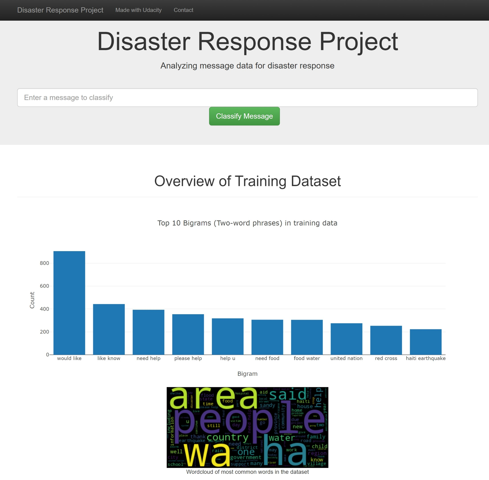
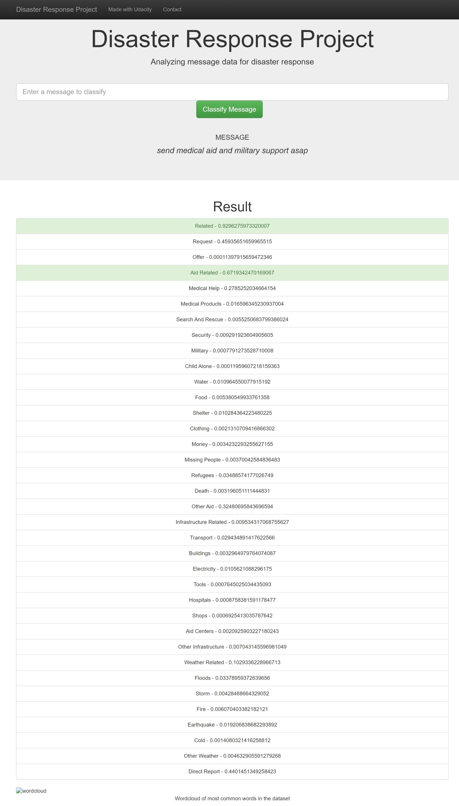

# Disaster Response Pipeline Project

### Project Overview:
This project is part of the Data Science Nanodegree Program by Udacity. The goal of this project is to analyze disaster data from Figure Eight to build a model for an API that classifies disaster messages.

### Project Components:
1. ETL Pipeline:
    - Loads the messages and categories datasets
    - Merges the two datasets
    - Cleans the data
    - Stores it in a SQLite database

2. ML Pipeline:
    - Loads data from the SQLite database
    - Splits the dataset into training and test sets
    - Builds a text processing and machine learning pipeline
    - Trains and tunes a model using GridSearchCV
    - Outputs the results on the test set
    - Exports the final model as a pickle file

3. Flask Web App:
    - Data visualization using Plotly
    - Classify messages in real-time

### File Structure:
- app
    - template
        - master.html  # main page of web app
        - go.html  # classification result page of web app
    - run.py  # Flask file that runs the app
- data
    - disaster_categories.csv  # data to process
    - disaster_messages.csv  # data to process
    - process_data.py
    - DisasterResponse.db   # database to save clean data to
- models
    - train_classifier.py
    - classifier.pkl  # saved model
- README.md

### Instructions:
1. Run the following commands in the project's root directory to set up your database and model.

    - To run ETL pipeline that cleans data and stores in database
        `python data/process_data.py data/disaster_messages.csv data/disaster_categories.csv data/DisasterResponse.db`
    - To run ML pipeline that trains classifier and saves
        `python models/train_classifier.py data/DisasterResponse.db models/classifier.pkl`

2. Run the following command in the app's directory to run your web app.
    `python run.py`

3. Go to http://0.0.0.0:3001/

### Screenshots:
1. Home Page:

2. Message Classification:

### Acknowledgements:
- [Udacity](https://www.udacity.com/)
- [Figure Eight](https://www.figure-eight.com/)
- [Stack Overflow](https://stackoverflow.com/)
- [Flask](https://flask.palletsprojects.com/en/1.1.x/)
- [Plotly](https://plotly.com/)
- [Scikit-learn](https://scikit-learn.org/stable/)
- [SQLite](https://www.sqlite.org/index.html)
- [Pandas](https://pandas.pydata.org/)
- [NumPy](https://numpy.org/)
- [NLTK](https://www.nltk.org/)
- [SQLAlchemy](https://www.sqlalchemy.org/)
- [Joblib](https://joblib.readthedocs.io/en/latest/)
- [Matplotlib](https://matplotlib.org/)
- [Seaborn](https://seaborn.pydata.org/)
- [Pickle](https://docs.python.org/3/library/pickle.html)
- [Jupyter Notebook](https://jupyter.org/)
- [Python](https://www.python.org/)
- [HTML](https://html.spec.whatwg.org/multipage/)
- [CSS](https://www.w3.org/Style/CSS/Overview.en.html)
- [JavaScript](https://developer.mozilla.org/en-US/docs/Web/JavaScript)
- [Bootstrap](https://getbootstrap.com/)

### License:
This project is licensed under the MIT License - see the [LICENSE](LICENSE) file for details.

### Credits:
An Dinh Ngoc - andythetechnerd03
